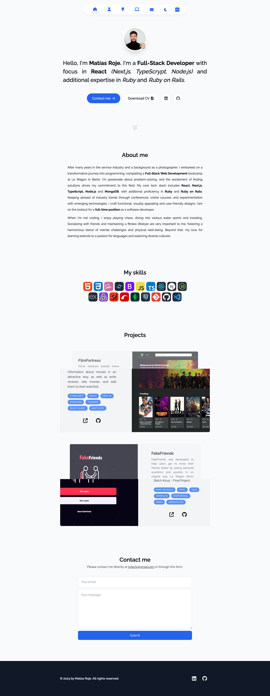

# Matías Roje — Personal Portfolio

Welcome to my portfolio website! This project is a showcase of my skills and projects, developed using Next.js, React, Tailwind CSS, Framer Motion, React Hot Toast, Resend, and React Email. The entire project is built with TypeScript for enhanced type safety.

## Demo

Visit [My Portfolio](https://mr-portfolio-site.vercel.app/) to see the live demo!

**Portfolio Screenshot:**

## Technologies Used

- **Next.js**: React framework for server-rendered React applications.
- **React**: A JavaScript library for building user interfaces.
- **Tailwind CSS**: A utility-first CSS framework.
- **Framer Motion**: A React animation library.
- **React Hot Toast**: Elegant toast notifications for React.
- **Resend**: Resend is used for the backend, using the new server actions feature from Next.js to sent the emails.
- **React Email**: React Email is employed for styling emails sent through the contact form.
- **TypeScript**: A typed superset of JavaScript that compiles to plain JavaScript.

## Features

- **Responsive Design**: Ensures a seamless experience across various devices.
- **Animated Transitions**: Smooth page transitions powered by Framer Motion.
- **Smooth Scrolling**: Enjoy a seamless scrolling experience, dynamically accessible through the navbar.
- **Toast Notifications**: Real-time feedback with React Hot Toast.
- **Email Integration**: Resend is utilized for the backend functionality, while React-Email handles the styling of emails sent through the contact form.
- **Context API for Themes and Languages**: The React Context API is employed for dynamically changing themes and languages.
